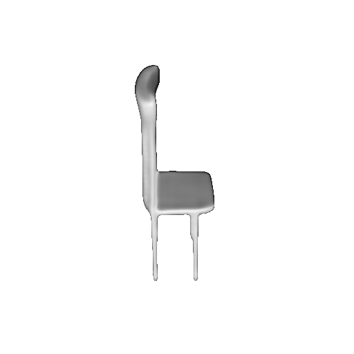
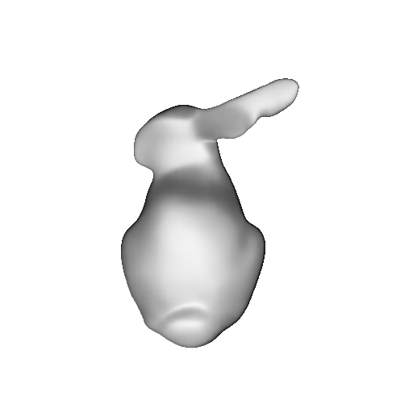
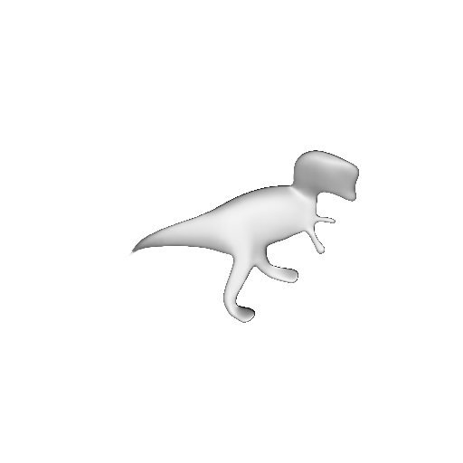

#  RenderNet
Code release for RenderNet: A deep convolutional network for differentiable rendering from 3D shapes

__All these objects are rendered with the same network__
<p><table>
  <tr valign="top">
    <td width="23%"></td>
    <td width="23%"></td>
    <td width="23%"></td>
    <td width="23%"></td>
  </tr>
</table></p>

[RenderNet: A deep convolutional network for differentiable rendering from 3D shapes](https://www.monkeyoverflow.com/#/rendernet-a-cnn-for-differentiable-rendering-from-3d-shapes/)  
[Thu Nguyen-Phuoc](https://monkeyoverflow.com), [Chuan Li](https://lambdalabs.com/blog/author/chuan/), [Stephen Balaban](https://lambdalabs.com/), [Yong-liang Yang](http://yongliangyang.net/)  
(To appear) Neural Information Processing Systems 2018   

## Dataset

If you want to use your own data, the training images must be combined into a *.tar file, and the voxel files can be stored in a directory. To create TAR file:

```
python tools/create_TAR.py --images_path --save_path --file_format --to_compress
```

Download the mesh voxeliser here: https://www.patrickmin.com/binvox/

## Training

Tested with Ubuntu 16.04, Tensorflow 1.4, CUDA 8.0, cuDNN 6. 

Download the datasets and put them in the " data" folder

- To run the training of rendering shaders

```	
python render/RenderNet_Shader.py config_RenderNet.json
```
Help with config

```
image_path: 
			path to training images Tar file for training
image_path_valid: 
			path to training images Tar file for validation
model_path:
			path to binvox models diretory
is_greyscale:
			"True" if the training images are greyscale, "False" otherwise
gpu: 
			number of the GPU to use. Default: 0
batch_size: 
			size of training batches. Default: 24
max_epochs: 
			number of epochs to train. Default: 20
threshold: 
			threshold to binarized voxel grids. Default: 0.1
e_eta: 
			learning rate. Default: 0.00001
keep_prob: 
			the probability that each element is kept, used for Dropout. Default: 0.75
decay_steps:
			number of udpates before learning rate decayse.
trained_model_name: 
			named of the trained model. Default: "RenderNet"
sample_save:
			path to save the training results
check_point_secs: 
			Timelapse before saving the trained model. Default: 7200
```

- To run the training of rendering texture

```
python render/RenderNet_Textue_Face_Normal.py config_RenderNet_texture.json
```

Help with config

```
image_path: 
			path to training images Tar file for training
image_path_valid: 
			path to training images Tar file for validation
normal_path:
			path to normal maps diretory
texture_path:
			path to texture diretory
model_path:
			path to binvox models diretory
gpu: 
			number of the GPU to use. Default: 0
batch_size: 
			size of training batches. Default: 24
max_epochs: 
			number of epochs to train. Default: 20
threshold: 
			threshold to binarized voxel grids. Default: 0.1
e_eta: 
			learning rate. Default: 0.00001
keep_prob: 
			the probability that each element is kept, used for Dropout. Default: 0.75
decay_steps:
			number of udpates before learning rate decays. Defaule: 90000
trained_model_name: 
			named of the trained model. Default: "RenderNet"
sample_save:
			path to save the training results
check_point_secs: 
			Timelapse before saving the trained model. Default: 7200
```

- To run the reconstruction from image

```
python reconstruction/Reconstruct_RenderNet_Face.py config_.json
```
Help with config

```
target_normal:
			path to the target normal map. Used to create the final shaded image for 			 inverse-rendering
target_albedo:
			path to the target albedo.Used to create the final shaded image for 			    inverse-rendering
weight_dir: 
			path to the weights of a pretrained RenderNet
weight_dir_decoder: 
			path to the weights of a pretrained shape autoencoder
gpu: 
			number of the GPU to use. Default: 0
batch_size: 
			size of training batches. Default: 24
max_epochs: 
			number of epochs to train. Default: 20
z_dim:
			dimension of the shape latent vector. Default: 200
threshold:
			threshold to binarized voxel grids. Default: 0.3
shape_eta:
			Learning rate to update the reconstructed shape vector. Default: 0.8
pose_eta:
			Learning rate to update the reconstructed pose.Default:0.01
tex_eta:
			Learning rate to update the reconstructed texture vector. Default: 0.8
light_eta:
			Learning rate to update the reconstructed light. Default: 0.4
decay_steps: 
			Default: 90000
trained_model_name: 
			named of the trained model. Default: "RenderNet"
sample_save:
			path to save the training results
check_point_secs: 
			Timelapse before saving the trained model. Default: 3600
```

### Demo of a trained RenderNet for Phong shading

Tested with Ubuntu 16.04, Tensorflow 1.8, CUDA 9.0, cuDNN 7. 

The following steps set up a python virtual environment and install the necessary dependencies to run the demo.

__Install Python, pip and virtualenv__

On Ubuntu, Python is automatically installed and pip is usually installed. Confirm the python and pip versions:

```
  python -V # Should be 2.7.x
  pip -V # Should be 10.x.x
```

Install these packages on Ubuntu:
```
sudo apt-get install python-pip python-dev python-virtualenv
```

__Create a virtual environment and install all dependencies__
```
cd the_folder_contains_this_READEME
virtualenv rendernetenv
source rendernetenv/bin/activate
pip install -r requirement.txt
```

__Download pre-trained model__

https://drive.google.com/open?id=1TwtJ6FXNCCm0H40nDQtZ_FIqGsgR97z3

Download the pb file and move it into the "model" folder.

__Help__
```
usage: RenderNet_demo.py [-h] [--voxel_path VOXEL_PATH] [--azimuth AZIMUTH]
                         [--elevation ELEVATION]
                         [--light_azimuth LIGHT_AZIMUTH]
                         [--light_elevation LIGHT_ELEVATION] [--radius RADIUS]
                         [--render_dir RENDER_DIR] [--rotate ROTATE]

optional arguments:
  -h, --help            show this help message and exit
  --voxel_path VOXEL_PATH
                        Path to the input voxel. (default:
                        ./voxel/Misc/bunny.binvox)
  --azimuth AZIMUTH     Value of azimuth, between (0,360) (default: 250)
  --elevation ELEVATION
                        Value of elevation, between (0,360) (default: 60)
  --light_azimuth LIGHT_AZIMUTH
                        Value of azimuth for light, between (0,360) (default:
                        250)
  --light_elevation LIGHT_ELEVATION
                        Value of elevation for light, between (0,360)
                        (default: 60)
  --radius RADIUS       Value of radius, between (2.5, 4.5) (default: 3.3)
  --render_dir RENDER_DIR
                        Path to the rendered images. (default: ./render)
  --rotate ROTATE       Flag rotate and render an object by 360 degree in
                        azimuth. Overwrites early settings in azimuth.
                        (default: False)
```
__Example: rotate bunny by 360 degrees__
```
python RenderNet_demo.py --voxel_path ./voxel/Misc/bunny.binvox --rotate

convert -delay 10 -loop 0 ./render/*.png animation.gif
```
__Example: chair__
```
python RenderNet_demo.py --voxel_path ./voxel/Chair/64.binvox \
                         --azimuth 250 \
                         --elevation 60 \
                         --light_azimuth 90 \
                         --light_elevation 90 \
                         --radius 3.3 \
                         --render_dir ./render
```

__Example: rotate an object by 360 degrees__
```
python RenderNet_demo.py --voxel_path ./voxel/Chair/64.binvox --rotate

python RenderNet_demo.py --voxel_path ./voxel/Table/0.binvox --rotate

python RenderNet_demo.py --voxel_path ./voxel/Misc/tyra.binvox --rotate
```

__Uninstall__

```
rm -rf the_folder_contains_this_READEME # This will remove both the code and the virtual environment
```

### Citation

If you use this code for your research, please cite our paper

```
@inproceedings{RenderNet2018,
  title={RenderNet: A deep convolutional network for differentiable rendering from 3D shapes},
  author={Nguyen-Phuoc, Thu and Li, Chuan and Balaban, Stephen and Yang, Yong-Liang},
  booktitle={Advances in Neural Information Processing Systems 31},
  year={2018}
}
```